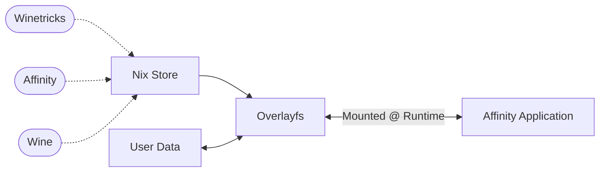

# affinity-nix


## About

Affinity v3 & v2 packaged with Nix!

Based on https://github.com/lf-/affinity-crimes and https://affinity.liz.pet/, and uses [ElementalWarrior's wine](https://gitlab.winehq.org/ElementalWarrior/wine).

We also install https://github.com/noahc3/AffinityPluginLoader for a far more pleasant experience.

There is a sister project which allows you to run these packages on any Linux distro through AppImages, [affinity-everywhere](https://github.com/mrshmllow/affinity-everywhere).

## Support

Thank you to my GitHub sponsors!


## Preamble

> [!TIP]
> [Add garnix as a substituter](https://garnix.io/docs/ci/caching/) to avoid compiling yourself.

> [!NOTE]
> This repo does not attempt to redistribute affinity archives. Any instance of caching Canva IP should be reported as a bug.

User preferences are located in `$XDG_DATA_HOME/affinity/` or `$XDG_DATA_HOME/affinity-v3/` falling back to `$HOME/.local/share/affinity/` or `$HOME/.local/share/affinity-v3/`.

## How it works

A wine prefix containing all the necessary dependencies and the affinity installation is built in nix and mounted at runtime.
Overlayfs is used to keep your user preferences intact. [fuse-overlayfs](https://github.com/containers/fuse-overlayfs) will be fallen back on if your kernel rejects unprivileged user namespaces, common on hardened systems. This can reduce performance.



## Usage Instructions

### Running Ad-hoc

```bash
$ nix run github:mrshmllow/affinity-nix#affinity-v3

-- v2 versions:

$ nix run github:mrshmllow/affinity-nix#affinity-photo
$ nix run github:mrshmllow/affinity-nix#affinity-designer
$ nix run github:mrshmllow/affinity-nix#affinity-publisher
```

### Installing the applications on your system (Optional)

#### Install with nix-profile

```bash
$ nix profile install github:mrshmllow/affinity-nix#affinity-v3

-- v2 versions:

$ nix profile install github:mrshmllow/affinity-nix#affinity-photo
$ nix profile install github:mrshmllow/affinity-nix#affinity-designer
$ nix profile install github:mrshmllow/affinity-nix#affinity-publisher
```

#### Install on NixOS / Home Manager

Installing via an overlay is recommended, as the package is `unfree` 
making it difficult to use directly.

Install with NixOS:

```nix
{
  inputs = {
    affinity-nix.url = "github:mrshmllow/affinity-nix";
    # ...
  };

  outputs = inputs @ {
    affinity-nix,
    ...
  }: {
    nixosConfigurations.my-system = nixpkgs.lib.nixosSystem {
      system = "x86_64-linux";
      specialArgs = {inherit inputs;};
      modules = [
        # ...
        ({ pkgs, ... }: {
          nixpkgs.overlays = [ affinity-nix.overlays.default ];

          environment.systemPackages = [ pkgs.affinity-v3 ];
        })
      ];
    };
  }
}
```

Install with Home Manager:

```nix
{
  inputs = {
    affinity-nix.url = "github:mrshmllow/affinity-nix";
    # ...
  };

  outputs = inputs @ {
    affinity-nix,
    ...
  }: {
    homeConfigurations.my-user = home-manager.lib.homeManagerConfiguration {
      pkgs = nixpkgs.legacyPackages."x86_64-linux";
      extraSpecialArgs = {inherit inputs;};
      modules = [
        # ...
        ({ pkgs, ... }: {
          nixpkgs.overlays = [ affinity-nix.overlays.default ];

          home.packages = [ pkgs.affinity-v3 ];
        })
      ];
    };
  }
}
```

Install without flakes:

```nixos
{ config, pkgs, ... }:

let
  affinity = import (fetchTarball "https://github.com/mrshmllow/affinity-nix/archive/refs/heads/main.tar.gz");
in
{
  nixpkgs.overlays = [
      affinity.overlays.default
  ];

  users.users.my-user.packages = with pkgs; [
      affinity-photo
  ];
}
```

### Troubleshooting, winetricks, wineboot, and more

Each package (`v3|photo|designer|publisher`) has the following usage:

```sh
$ affinity-v3 --help
Usage: affinity-v3 [OPTIONS] [AFFINITY_ARGUMENTS]... [COMMAND]

Commands:
  wine        Run wine within sandbox
  winetricks  Run winetricks within sandbox
  wineboot    Run wineboot within sandbox
  wineserver  Run wineserver within sandbox
  help        Print this message or the help of the given subcommand(s)

Arguments:
  [AFFINITY_ARGUMENTS]...  Arguments for affinity application

Options:
      --verbose  Make Wine far more verbose
  -h, --help     Print help
  -V, --version  Print version

```

> [!TIP]
> Armed with these you should be able to follow https://affinity.liz.pet/v2/misc-troubleshooting/ for troubleshooting steps.

For example, accessing `wine`:

```sh
$ affinity-v3 wine
Usage: wine PROGRAM [ARGUMENTS...]   Run the specified program
       wine --help                   Display this help and exit
       wine --version                Output version information and exit

```

Or `winecfg`:

```sh
$ affinity-v3 wine winecfg
```
