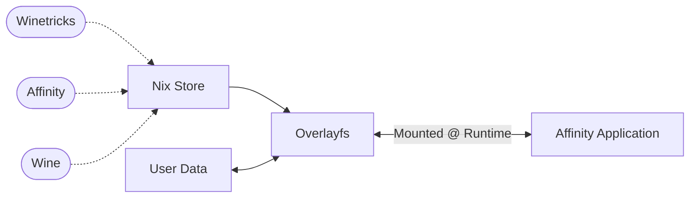

# affinity-nix


## About

Affinity v3 & v2 packaged with Nix!

> [!NOTE]
> **This is a fork** of [mrshmllow/affinity-nix](https://github.com/mrshmllow/affinity-nix).
> It carries two changes not yet in upstream ([PR #280](https://github.com/mrshmllow/affinity-nix/pull/280) pending):
>
> 1. `meta.mainProgram` fix — removes the `getExe` evaluation warning on install (#276).
> 2. Documented workaround for the Affinity v3 startup crash
>    (CLR error 80131506): launch without the plugin loader via
>    `affinity-v3 wine "C:\Program Files\Affinity\Affinity\Affinity.exe"`
>    (see [Troubleshooting](#startup-crash-net-runtime-internal-error-exit-80131506)).
>
> All commands below reference this fork.

Based on https://github.com/lf-/affinity-crimes and https://affinity.liz.pet/, and uses [ElementalWarrior's wine](https://gitlab.winehq.org/ElementalWarrior/wine).

We also install https://github.com/noahc3/AffinityPluginLoader for a far more pleasant experience.

> [!WARNING]
> Affinity on Wine is far from perfect and you will likely experience bugs and issues. Please have patience and [report any issues you experience](https://github.com/mrshmllow/affinity-nix/issues/new/choose).

## Support

Thank you to my GitHub sponsors!


## Preamble

> [!TIP]
> We provide a binary cache for this repo. Please [add cache.forall.systems as a substituter](https://cache.forall.systems/) to avoid compiling yourself.

> [!NOTE]
> This repo does not attempt to redistribute affinity archives. Any instance of caching Canva IP should be reported as a bug.

User preferences are located in `$XDG_DATA_HOME/affinity/` or `$XDG_DATA_HOME/affinity-v3/` falling back to `$HOME/.local/share/affinity/` or `$HOME/.local/share/affinity-v3/`.

## How it works

A wine prefix containing all the necessary dependencies and the affinity installation is built in nix and mounted at runtime.
Overlayfs is used to keep your user preferences intact. [fuse-overlayfs](https://github.com/containers/fuse-overlayfs) will be fallen back on if your kernel rejects unprivileged user namespaces, common on hardened systems. This can reduce performance.


```mermaid
graph LR;
    A([Winetricks])-.->B[Nix Store];
    C([Affinity])-.->B;
    D([Wine])-.->B;

    B e1@-->E[Overlayfs];
    F[User Data] e2@<-->E;

    E<-- Mounted @ Runtime -->G[Affinity Application];
```

## Usage Instructions

### Running Ad-hoc

```bash
$ nix run github:rastarr/affinity-nix#affinity-v3

-- v2 versions:

$ nix run github:rastarr/affinity-nix#affinity-photo
$ nix run github:rastarr/affinity-nix#affinity-designer
$ nix run github:rastarr/affinity-nix#affinity-publisher
```

> [!IMPORTANT]
> The package is `unfree` (it contains Affinity binaries). A user-profile
> install does not inherit your NixOS `allowUnfree` setting, so pass it
> explicitly:
>
> ```bash
> $ NIXPKGS_ALLOW_UNFREE=1 nix profile install github:rastarr/affinity-nix#affinity-v3 --impure
> ```
>
> (`nix run` needs the same environment: `NIXPKGS_ALLOW_UNFREE=1 nix run ... --impure`.)

### Installing the applications on your system (Optional)

#### Install with nix-profile

```bash
$ nix profile install github:rastarr/affinity-nix#affinity-v3

-- v2 versions:

$ nix profile install github:rastarr/affinity-nix#affinity-photo
$ nix profile install github:rastarr/affinity-nix#affinity-designer
$ nix profile install github:rastarr/affinity-nix#affinity-publisher
```

#### Install on NixOS / Home Manager with Flakes

Installing via an overlay is recommended, as the package is `unfree` 
making it difficult to use directly.

Install with NixOS:

```nix
# flake.nix
{
  inputs = {
    affinity-nix.url = "github:rastarr/affinity-nix";
    # ...
  };

  outputs = inputs @ {
    affinity-nix,
    ...
  }: {
    nixosConfigurations.my-system = nixpkgs.lib.nixosSystem {
      system = "x86_64-linux";
      specialArgs = {inherit inputs;};
      modules = [
        # ...
        ({ pkgs, ... }: {
          nixpkgs.overlays = [ affinity-nix.overlays.default ];

          environment.systemPackages = [ pkgs.affinity-v3 ];
        })
      ];
    };
  }
}
```

Install with Home Manager:

```nix
# flake.nix
{
  inputs = {
    affinity-nix.url = "github:rastarr/affinity-nix";
    # ...
  };

  outputs = inputs @ {
    affinity-nix,
    ...
  }: {
    homeConfigurations.my-user = home-manager.lib.homeManagerConfiguration {
      pkgs = nixpkgs.legacyPackages."x86_64-linux";
      extraSpecialArgs = {inherit inputs;};
      modules = [
        # ...
        ({ pkgs, ... }: {
          nixpkgs.overlays = [ affinity-nix.overlays.default ];

          home.packages = [ pkgs.affinity-v3 ];
        })
      ];
    };
  }
}
```

#### Install on NixOS without Flakes

Install without flakes:

```nixos
# configuration.nix
{ config, pkgs, ... }:

let
  affinity = import (fetchTarball "https://github.com/rastarr/affinity-nix/archive/refs/heads/main.tar.gz");
in
{
  nixpkgs.overlays = [
      affinity.overlays.default
  ];

  users.users.my-user.packages = with pkgs; [
      affinity-photo
  ];
}
```

### Troubleshooting, winetricks, wineboot, and more

Each package (`v3|photo|designer|publisher`) has the following usage:

```sh
$ affinity-v3 --help
Usage: affinity-v3 [OPTIONS] [AFFINITY_ARGUMENTS]... [COMMAND]

Commands:
  wine        Run wine within sandbox
  winetricks  Run winetricks within sandbox
  wineboot    Run wineboot within sandbox
  wineserver  Run wineserver within sandbox
  help        Print this message or the help of the given subcommand(s)

Arguments:
  [AFFINITY_ARGUMENTS]...  Arguments for affinity application

Options:
      --verbose  Make Wine far more verbose
  -h, --help     Print help
  -V, --version  Print version

```

> [!TIP]
> Armed with these you should be able to follow https://affinity.liz.pet/v2/misc-troubleshooting/ for troubleshooting steps.

For example, accessing `wine`:

```sh
$ affinity-v3 wine
Usage: wine PROGRAM [ARGUMENTS...]   Run the specified program
       wine --help                   Display this help and exit
       wine --version                Output version information and exit

```

Or `winecfg`:

```sh
$ affinity-v3 wine winecfg
```

### Startup crash: `.NET Runtime` internal error (exit 80131506)

Some Affinity v3 launches crash during startup with the APL plugin loader:

```
err:eventlog: "The process was terminated due to an internal error in the
.NET Runtime ... with exit code 80131506"
err:seh: Unhandled exception code c0000005
Affinity exited with code -1073741819
```

This is a startup race between the plugin loader's bootstrap injection and
Affinity's .NET CLR initialisation (see
[#97](https://github.com/mrshmllow/affinity-nix/issues/97) and
[#276](https://github.com/mrshmllow/affinity-nix/issues/276)). The crash is
intermittent — the same launch can succeed on a retry — but on some systems
it becomes near-deterministic, and `APLHOOK_DETACH=1 affinity-v3` (which skips
the hook's CLR wait loop) only reduces the odds rather than removing the race.

#### Reliable workaround: launch without the plugin loader

Bypass the hook entirely and run Affinity directly under the sandboxed wine:

```sh
$ affinity-v3 wine "C:\Program Files\Affinity\Affinity\Affinity.exe"
```

This starts Affinity with no runtime patching. Verified stable on a machine
where the APL-hook path crashed 11/11 times. Trade-offs to be aware of:

- **Decline any in-app update prompt** (e.g. 3.2.3) — unpatched Affinity will
  offer to self-update, and newer builds are untested under this wine.
- Without the loader's login patches the Canva sign-in flow must run in the
  embedded browser, which may not work under wine; if you rely on those
  patches, prefer retrying the normal `APLHOOK_DETACH=1 affinity-v3` launch
  a few times instead.
